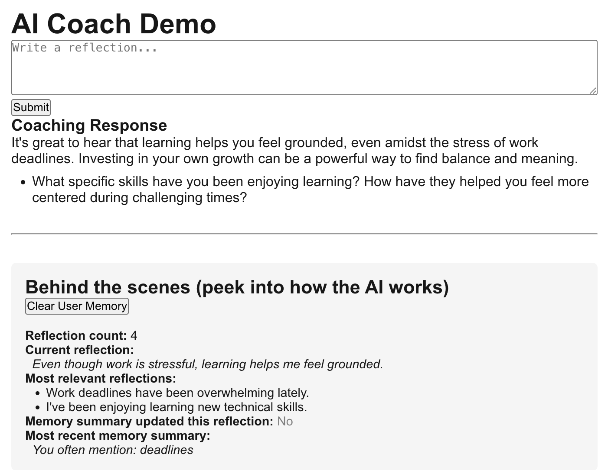

## AI Coach Demo

AI coaching demo that captures user reflections, retrieves relevant past context using vector similarity, and generates reflective coaching responses using an LLM.
Showcases a full-stack AI system, not just an LLM call. Designed to be compact, explainable, and easy to reason about — while still reflecting real production architecture patterns.

## ✨ What This Demo Shows

<table>
<tr>
<td width="250">

</td>

<td width="70%">

- Capture short, natural-language reflections from a user (NextJS)
- Embed and store reflections as vectors (Pinecone or local)
- Retrieve semantically relevant past reflections (Pinecone or local)
- Maintain a lightweight memory summary over time (Heuristic)
- Generate context aware coaching responses with follow-up questions (Claude or local)
- Clearly separate UI, API, AI, and storage layers
- Feature-flagged architecture to control cost & complexity

</td>

</tr>
</table>

## 🧱 Architecture Overview

### Design Principles
- Memory > Chat: The system reflects patterns, not just answers prompts
- Explainable retrieval: You can inspect why reflections were surfaced
- Cost aware: paid services (Claude, Pinecone) are opt-in and optional
- Composable: Each layer can evolve independently, easy to swap models, vector stores, or UIs without rewriting logic

### Key Layers

Full stack, layered flow: NextJS (UI) → NodeJS → Python (AI) → NodeJS → NextJS (UI)

- **NextJS (UI)**
  - User reflection input
  - Display coaching response
  - Behind the scenes AI/Debug view emphasizing transparency into why the system responds the way it does (relevant reflections, memory summaries)

- **NodeJS (API Orchestration)**
  - API boundary between UI and AI bridges frontend and AI services witout coupling UI to AI logic

- **Python/FastAPI (AI Layer)**
  - Core AI coaching engine
  - Reflection embedding and storage (local or Pinecone)
  - Relevant reflection retrieval (local or Pinecone)
  - Memory summarization (local heuristics)
  - Coaching response generation (local or Claude)

## 🧪 Demo Walkthrough

A curated sequence that shows the system’s strengths clearly:

1. “Work deadlines have been overwhelming lately.”

   → LLMs allows coaching to occur right away

2. “Deadlines make it hard for me to relax, even after hours.”

   → Relevant reflections retrieved 
   
3. “I’ve been enjoying learning new technical skills.”

   → Memory summary begins to form (“deadlines”)  
   → System surfaces theme contrast between stress & learning  
   → Coaching response bridges both themes

4. “Even though work is stressful, learning helps me feel grounded.”

   → Relevant memories retrieved across themes  
   → Reflective coaching with follow-up questions

This demonstrates:
- Vector similarity in action
- Memory accumulation over time
- Claude generating context-aware coaching
- No AI logic is hardcoded - try your own sequence of reflections!

## ⚠️ Known Limitations
Demo intentionally uses:
- Simple, hash-based embedding 
- Lightweight memory summarization 
- Single user, simple UI
- Coaching tone is supportive and not intended for mental health diagnosis or treatment

These tradeoffs make the system behavior:
- Easy to explain and demo, while pointing toward how a production system could evolve
- Easy to experiment with how different AI models support different user use cases

## 🚀 Getting Started
- Clone the repo
- Create a virtual environment
- Install dependencies
- Add a .env file with your Claude & Pinecone keys
- Run the test harness (command line testing of AI layer only) or UI (full stack user experience)
- If you want to run or modify the system locally, see  [`DEVELOPMENT.md`](./DEVELOPMENT.md).

## 📄 License

MIT License — see [`LICENSE`](./LICENSE) file for details.